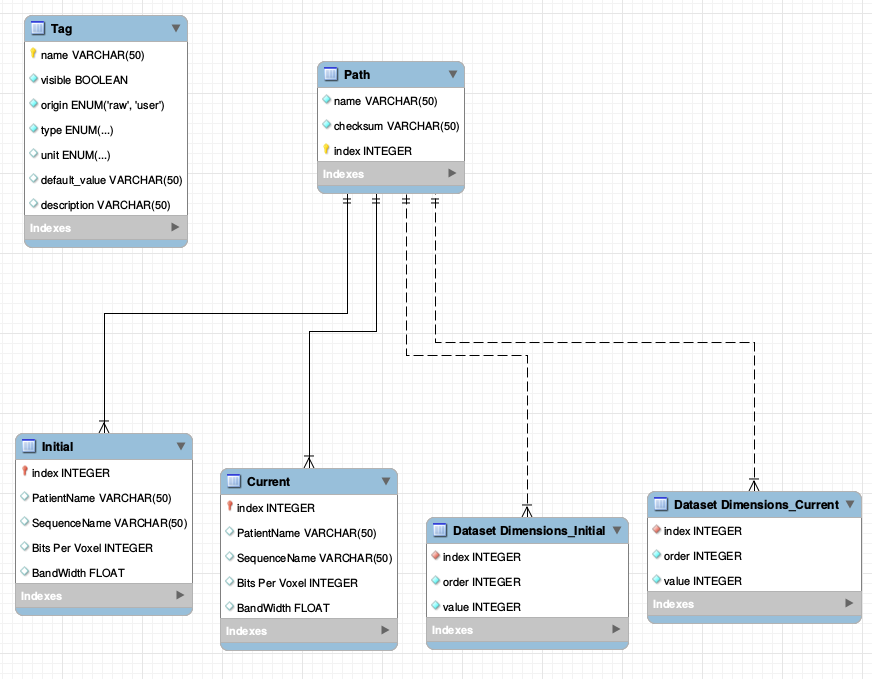

# populse_db 
SQLAlchemy based database API for Populse

# Tools

The database is working with SQLite, a .db file

The database is managed thanks to the ORM SQLAlchemy

# Relational schema

Type {string, integer, float, date, datetime, time, list_string, list_integer, list_float, list_date, list_datetime, list_time}
	
Unit {degree, ms, mm, MHz, Hz/pixel}

# Installation

python directory must be added to $PYTHONPATH 

# Import

	from populse_db.DatabaseModel import createDatabase, TAG_TYPE_INTEGER, ...

	from populse_db.Database import Database
	
# Tests

Unit tests written thanks to the python module unittest

Tested with Python2 and Python3

# Launch the tests

Add the directory python/populse_db in $PATH, or open this directory inside a terminal
	
	python2 Test.py  # With Python2
	
	python3 Test.py  # With Python3

