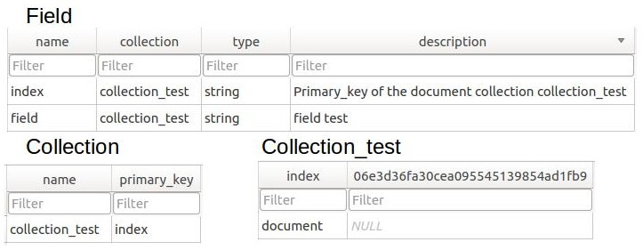

.. populse_db documentation master file, created by
   sphinx-quickstart on Thu Jul  5 16:12:12 2018.
   You can adapt this file completely to your liking, but it should at least
   contain the root `toctree` directive.

.. toctree::

   documentation

Generalities
============

Overview
--------

* SQLAlchemy based database API for Populse
* It can support every database type, it takes an engine as entry
* Populse_db is ensured to work with Python >= 3.3
* Populse_db is ensured to work on the platforms Linux and OSX (It is supposed to work on Windows, hasn't been tested yet)

Relational schema
-----------------

The relational schema of populse_db is generic, and completely dynamic.

Populse_db is composed of three elements:

* Collection (table)
* Field (column in a collection)
* Document (row in a collection)

The methods of the API populse_db mainly allow you to add and remove collections, fields, and documents.

Beware that all table and column names (except collection and field tables) are hashed with md5, in order to avoid issues with forbidden characters.

When a database is created, it is empty.

.. image:: ../pictures/schema.png

Both tables are empty, as there is no collection yet.

.. image:: ../pictures/empty_database.jpg

When a collection is added, it is added to the list of collections, and the collection table is created.

Exact call: session.add_collection("collection_test", "index")

.. image:: ../pictures/database_collection.jpg

When a document is added to a collection, a row is inserted in the collection table.

Exact call: session.add_document("collection_test", "document")

.. image:: ../pictures/database_document.jpg

When a field is added to a collection, it is added in the list of fields, and a column is created in the collection table.

Exact call: session.add_field("collection_test", "field", populse_db.database.FIELD_TYPE_STRING, "field test")

Requirements
------------

The modules required for populse_db are the following ones:

* sqlalchemy
* lark-parser
* python-dateutil

Other packages used
-------------------

The other packages used by populse_db are the following ones:

* ast
* copy
* datetime
* hashlib
* operator
* os
* re
* six
* tempfile
* types
* unittest              

Documentation
-------------

* This documentation website has been generated with Sphinx
* The source code of this website is in docs/ directory (The website is actually in docs/html/ directory, but docs/index.html is redirecting to the website)

* Generate the website (from populse_db root directory):

.. code-block:: python
   
   cd docs/
   make html
   cp -R build/doctrees/ ./doctrees/
   cp -R build/html/ ./html/
   rm -d -r build/html/
   rm -d -r build/doctrees/
   cd ..

License
-------

The whole populse project is open source.

Populse_db is precisely released under the CeCILL-B software license.

You can find all the details on the license `here
<http://www.cecill.info/licences/Licence_CeCILL-B_V1-en.html>`_, or refer to the license file `here
<https://github.com/populse/populse_db/blob/master/LICENSE.en>`_.

