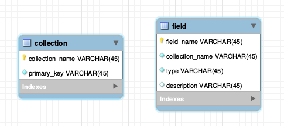
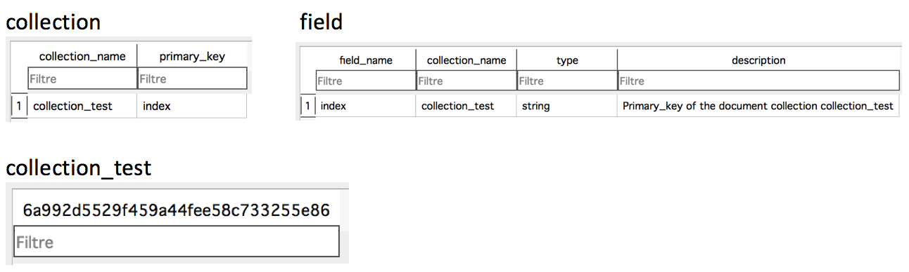

.. populse_db documentation master file, created by
   sphinx-quickstart on Thu Jul  5 16:12:12 2018.
   You can adapt this file completely to your liking, but it should at least
   contain the root `toctree` directive.

.. toctree::

=======================  =======================================
`Index <./index.html>`_  `Documentation <./documentation.html>`_
=======================  =======================================

Generalities
============

Overview
--------

* SQLAlchemy based database API for Populse
* It can support every database type, as it takes an engine as entry
* Populse_db is ensured to work with Python >= 3.3
* Populse_db is ensured to work on the platforms Linux, OSX, and Windows

Relational schema
-----------------

The relational schema of populse_db is generic, and completely dynamic.

Populse_db is composed of three elements:

* Collection (table)
* Field (column in a collection)
* Document (row in a collection)

The methods of the API populse_db mainly allow you to add and remove collections, fields, and documents.

Beware that all table and column names (except collection and field tables) are hashed with md5, in order to avoid issues with forbidden characters.

When a database is created, it is empty.

Both tables are empty, as there is no collection yet.

.. image:: ../pictures/empty_database.png

When a collection is added, it is added to the list of collections, and the collection table is created.

Exact call: session.add_collection("collection_test")

When a document is added to a collection, a row is inserted in the collection table.

Exact call: session.add_document("collection_test", "document")

.. image:: ../pictures/database_document.png

When a field is added to a collection, it is added in the list of fields, and a column is created in the collection table.

Exact call: session.add_field("collection_test", "field", populse_db.database.FIELD_TYPE_STRING, "field test")

.. image:: ../pictures/database_field.png

When a value is added to <collection, field, document>, the corresponding cell is set.

Exact call: session.new_value("collection_test", "document", "field", "new_value")

.. image:: ../pictures/database_value.png

Requirements
------------

The modules required for populse_db are the following ones:

* sqlalchemy
* lark-parser
* python-dateutil
* sphinx
* psycopg2

Other packages used
-------------------

The other packages used by populse_db are the following ones:

* ast
* copy
* datetime
* hashlib
* operator
* os
* re
* six
* tempfile
* types
* unittest              

Documentation
-------------

* This documentation website has been generated with Sphinx (See Sphinx website for more informations `here <http://www.sphinx-doc.org/en/master/>`_)

* The source code of this website is in docs/ directory (The website is actually in docs/html/ directory, but docs/index.html is redirecting to the website)

* Generate the website (from populse_db root directory):

.. code-block:: python
   
   cd docs/
   make html # The website generated will be in docs/html/ directory
   cd ..

* The website is deployed automatically thanks to GitHub pages (More informations are available on their website `here <https://pages.github.com/>`_)

* The option is available in the GitHub repository populse_db settings: See GitHub Pages subsection in Options section, it is currently set to master branch /docs folder

* The empty file docs/.nojekyll must be there in order to have CSS on the deployed GitHub website at https://populse.github.io/populse_db/ 

* The structure of the website that can be modified is in docs/source/ directory (for example, docs/source/index.rst is this current page)

* In order to install Sphinx, the following commands has been executed (from populse_db root directory):

.. code-block:: python
   
   pip install sphinx
   mkdir docs/
   cd docs/
   sphinx-quickstart
   """
   Default values, except the following ones:
    - Separate source and build directories (y/n) [n]: y
    - Project name: populse_db
    - Author name(s): populse
    - Project version: 1
    - Project release: 1.0.0
    - autodoc: automatically insert docstrings from modules (y/n) [n]: y
    - Create Windows command file? (y/n) [y]: n
   """
   """
   The following line (22) must be uncommented from docs/source/conf.py:
    - sys.path.insert(0, os.path.abspath('../..'))
   The following line (8) must be modified from docs/Makefile:
    - BUILDDIR      = BUILD  =>  BUILDDIR      = .
   """
   sphinx-apidoc -f -o source/ ../python/populse_db/

* After that, the documentation can be modified in docs/source directory, and built with make html command in docs/ directory

* The documentation is directly using the docstring from the source code to automatically generate the API

License
-------

The whole populse project is open source.

Populse_db is precisely released under the CeCILL-B software license.

You can find all the details on the license `here
<http://www.cecill.info/licences/Licence_CeCILL-B_V1-en.html>`_, or refer to the license file `here
<https://github.com/populse/populse_db/blob/master/LICENSE.en>`_.

